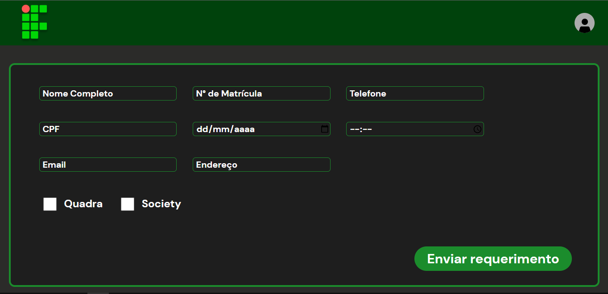

## Projeto de Requerimento Online
Projeto desenvolvido para auxiliar os requerimentos dos alunos, facilitando o acesso e organização dos requerimentos.

## Link do design feito no Figma

  

## Tech's

  
  
  
  

